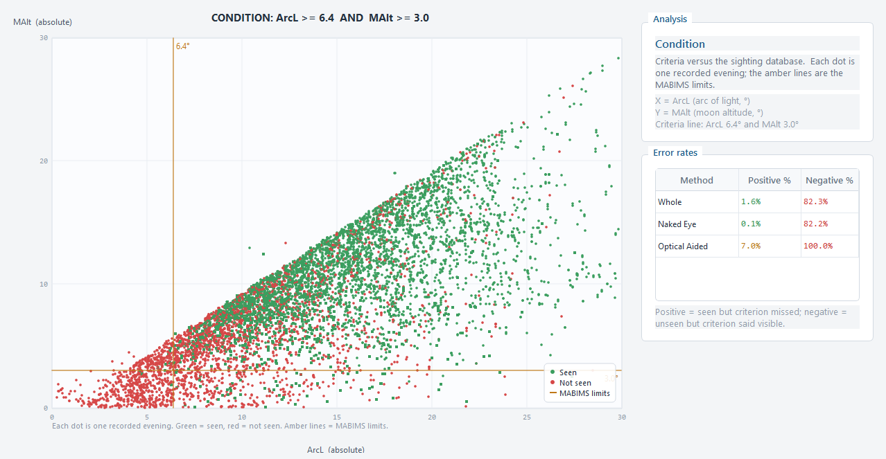
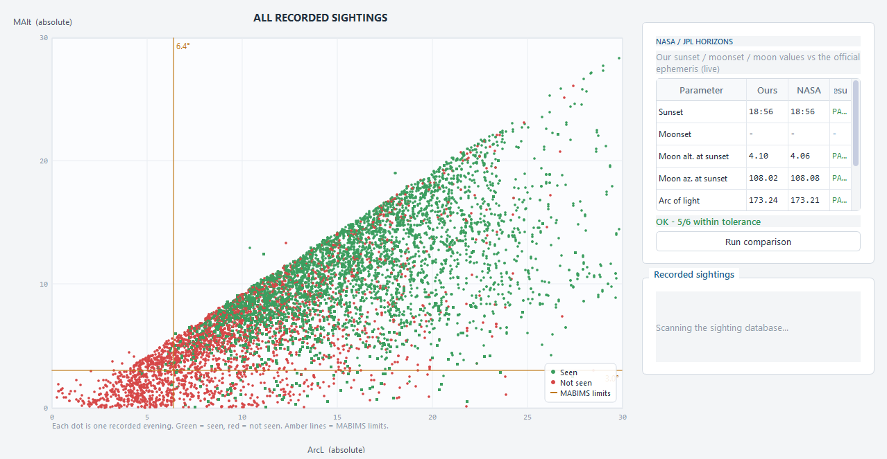
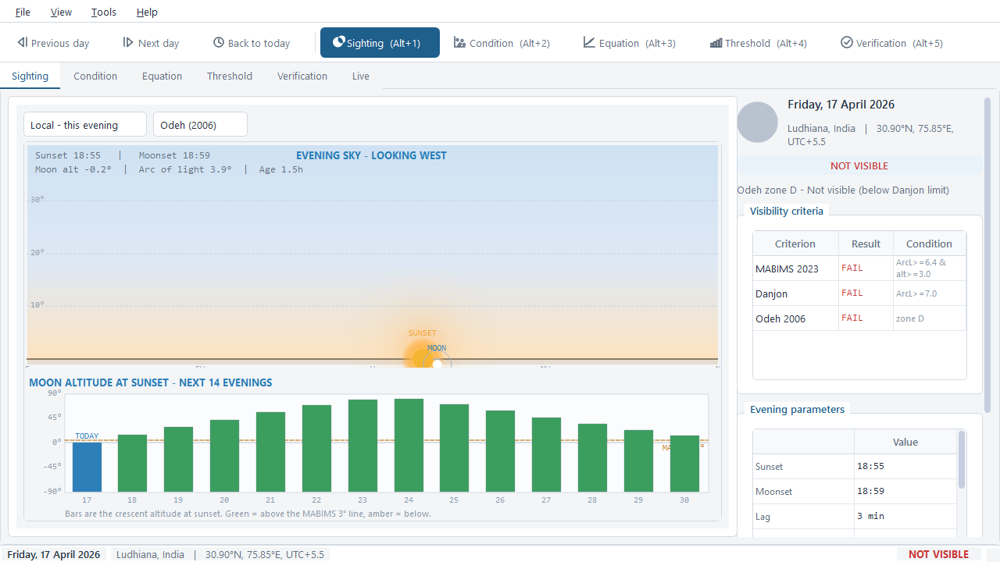

# Moon Watch — Crescent Visibility Workstation

A desktop application for predicting and analysing whether the new crescent of
Ramadan / Eid can be seen on a given evening from a given location.

This is a **PySide6 / Qt refactor** of the original pygame app: the astronomy,
analysis, calendar and verification engines are reused as-is, while the UI has
been rebuilt as a proper desktop workspace — light enterprise theme, six
tabbed views, dock-style tables and vector-rendered charts.

```
python main.py
```

Needs Python 3.11+, with `PySide6`, `numpy` and `pandas` (install once with
`pip install -r requirements.txt`). The `solarsystem` astronomy library is
vendored in `vendor/`, so no astronomy dependency is needed.

## Repository

* **This port** — [github.com/incredibleamir-dot/Crescent-Visibility-Workstation](https://github.com/incredibleamir-dot/Crescent-Visibility-Workstation)
* **Original pygame app** — [github.com/incredibleamir-dot/moon-watch](https://github.com/incredibleamir-dot/moon-watch)

## Workspaces

| # | View | What it does |
|---|------|--------------|
| 1 / S | Sighting | the prediction for the chosen evening: sky diagram + altitude chart + verdict panel; press **G** for a world crescent-visibility map |
| 2 / C | Condition | crescent altitude vs arc of light over the recorded sighting database |
| 3 / E | Equation | lag time vs arc of light against the visibility boundary curve |
| 4 / H | Threshold | box-and-whisker of minimum observed values for one parameter (cycle with X) |
| 5 / V | Verify | check our math against NASA/JPL HORIZONS and against real recorded sightings |
| 6 / L | Live | the Sun-Earth-Moon system right now (updates every 5 s) |

Every analysis chart shows a **white highlight ring** marking the evening you
have selected, and the ring follows you as you step through dates.

## Screenshots

| Sighting | Condition |
|---|---|
|  |  |

| Equation | Threshold |
|---|---|
|  |  |

| Verification | Live |
|---|---|
|  |  |

| Ramadan & Eid dates | User Guide |
|---|---|
|  |  |

| Global visibility map |
|---|
|  |

A detailed, in-app **User Guide** (Help ▸ Moon Watch User Guide, Ctrl+F1)
explains how to read every chart, how sunset / moonset, moon age,
illumination and crescent width are computed, and the maths behind the
MABIMS 2023 / Danjon / Odeh (2006) criteria.

## Controls

| Key | Action |
|-----|--------|
| Left / Right | previous / next day |
| T | jump to today |
| 1–6 or S / C / E / H / V / L | switch workspace |
| R | (re)run the NASA HORIZONS comparison |
| X | cycle the Threshold-analysis parameter |
| G | toggle the Sighting map (local sky / global visibility map) |
| D | Ramadan & Eid dates dialog |
| Ctrl+L | date & location dialog |
| Ctrl+F1 | User Guide |
| F1 | About |
| F11 | toggle fullscreen |
| Ctrl+Q | quit |

## Verdict panel (Sighting view)

- **CRESCENT VISIBLE** / **BORDERLINE** / **NOT VISIBLE** banner (amber
  border-line cases, red for not visible; **NO SUNSET** when the Sun never
  sets that day).
- Evening parameters: sunset / moonset, lag, best viewing time, moon age
  (days + hours), illumination, arc of light, moon altitude, arc of vision,
  crescent width.
- Criteria check with per-rule pass/fail:
  - **MABIMS 2023** — arc of light ≥ 6.4° and moon altitude ≥ 3.0°.
  - **Danjon** — arc of light ≥ 7.0° (thin-crescent visibility limit).
  - **Odeh 2006** — zone A (easy naked eye) … D (not visible).
- **IN PLAIN WORDS** — the same conclusion as a jargon-free sentence.

## Ramadan & Eid dates dialog

Lists the previous and next **Ramadan**, **Eid ul-Fitr** (1 Shawwal) and
**Eid ul-Adha** (10 Dhul Hijjah) for the chosen location and date, using the
app's own local-crescent-visibility rule for each new month.

The Islamic day starts at **sunset**: the "first night" of each month is the
evening when the young crescent becomes visible *after* the preceding civil
day, so each date is presented as *starts at sunset on evening E (AH) — first
civil day: E + 1*. Because the same physics drives the whole app, these dates
can legitimately differ from a fixed civil calendar.

## Verify view

- **NASA/JPL HORIZONS** — compares our sunset / moonset / moon altitude /
  azimuth / arc of light / illumination against the online ephemeris
  (**requires internet access**; press R, and press R again after changing
  the date).
- **Recorded sightings** — compares our verdict against ~8,000 real-world
  sightings bundled in `data/Final.csv`, with per-method match rates
  (naked eye / optical aid).

Both checks run in background sub-processes, so the UI stays fully
responsive while they work.

## Live view

A top-down diagram of the Sun-Earth-Moon system recomputed from your clock
every 5 seconds (or the 24 h scrubber): the Moon's orbit, the arc of the orbit
where the Moon is above the horizon at your location, the Moon at its true
phase, and the Earth shaded day/night with your location marked. A 24 h slider
gives the whole night, with **NOW** to snap back to the live instant. Textured
from the bundled `assets/` maps (a satellite photo for the LIVE Earth globe, a
Natural Earth black-and-white line map behind the visibility grid) when
available, with vector fallback.

## Global visibility map (Sighting view, key G)

Switch the Sighting map to **Global** to see, for the same evening, which
places on Earth could sight the crescent: every 1° cell is evaluated at that
place's *best time* — the same rules that drive the verdict pill below (Odeh
2006 zones at sunset + 4/9 of the moonset lag, MABIMS 2023 and Danjon at
their sunset/best instants) — then classified green (visible) / amber
(borderline) / red (not visible), with the no-sunset polar band left clear.
The two views therefore never disagree. The 1° grid (≈64k points) is computed
in a background sub-process once per date and cached in memory, so stepping
back and forth between dates is instant; your city is pinned on the map.

## Project layout

```
main.py                 entry point
moonwatch/
  theme.py              palette, stylesheet, fonts
  controller.py         shared state + computation threads
  charts.py             vector canvas widgets (sky, altitude, scatter, box, live)
  pages.py              the six workspace pages
  dialogs.py            date & location, Ramadan/Eid dates, About
  app_window.py         main window, menus, toolbar, shortcuts
astronomy.py            core ephemeris engine (reused, unchanged)
analysis.py             analysis engines (reused, unchanged)
islamic.py              Islamic calendar (reused, unchanged)
verification.py         HORIZONS + sightings checks (reused, unchanged)
vendor/solarsystem/     vendored astronomy library (unchanged)
data/Final.csv          recorded-sightings database
assets/                 Sun / Earth / Moon texture maps
```

See `PYGAME_TO_PYSIDE6.md` for the port mapping and `CREDITS.md` for
attribution.